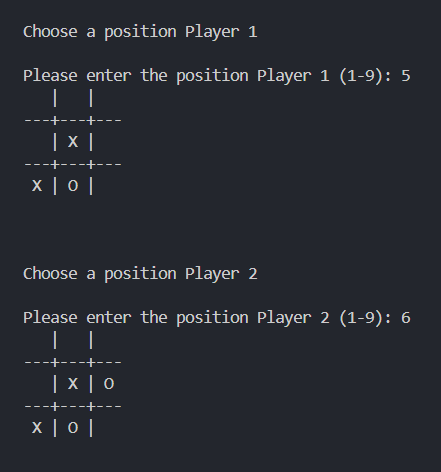

# 🕹️ Tic Tac Toe Game (Python)

A simple command-line Tic Tac Toe game built using Python. The game is designed for two players and is structured entirely using user-defined functions.

---

## 🎯 Features

- 2-player turn-based gameplay
- Input validation for occupied cells and invalid entries
- Clean and readable board UI using print formatting
- Functional modular design (user-defined functions)

---

## 📸 Demo



---

## 🧠 Tech Stack

- Python 3
- Command-line interface (CLI)
- No external libraries used

---

## 📝 License

This project is licensed under the [MIT License](LICENSE).

---

## 📂 How to Run

1. Clone this repo:
   ```bash
   git clone https://github.com/PRamyaChandrika/tic-tac-toe-game.git
